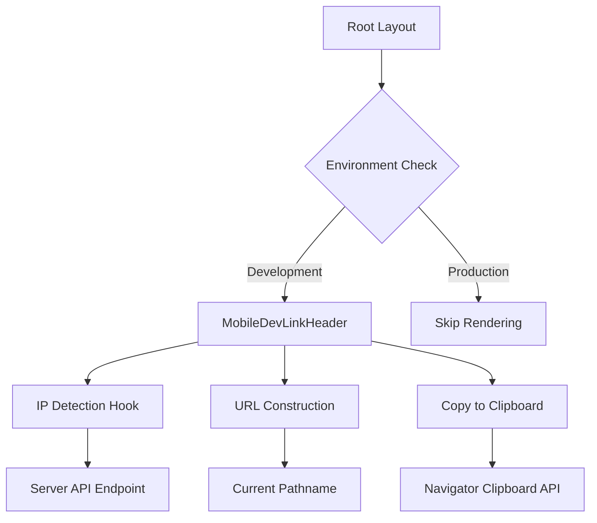
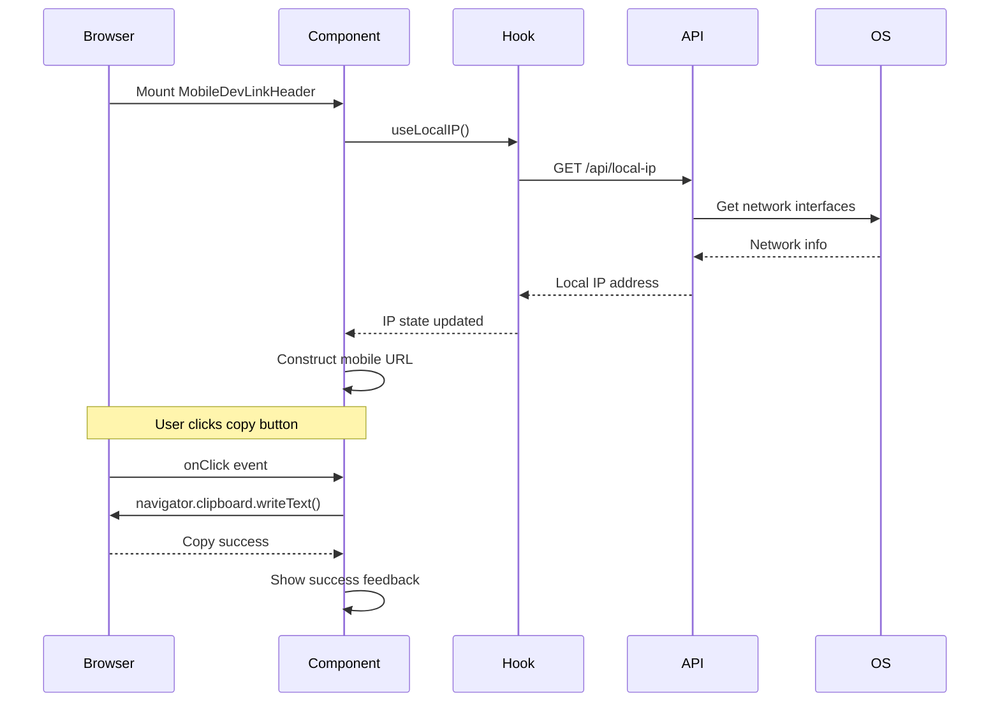

# Design Document: Mobile Dev Link Header

## Overview

A development-only header component that displays the current page's mobile-accessible URL (using local network IP) with one-click copy functionality. This enables developers to quickly access the same page on mobile devices during local development without manually typing URLs. The component is environment-aware, rendering only in development mode, and works across all routes including public storefront, admin CMS, and game pages.

## Architecture



## Main Algorithm/Workflow



## Components and Interfaces

### Component 1: MobileDevLinkHeader

**Purpose**: Main component that renders the development header with mobile link and copy functionality

**Interface**:
```typescript
interface MobileDevLinkHeaderProps {
  // No props needed - uses hooks for pathname and IP
}

export default function MobileDevLinkHeader(): JSX.Element | null
```

**Responsibilities**:
- Check environment (development only)
- Fetch and display local network IP
- Construct mobile-accessible URL from current pathname
- Provide one-click copy functionality
- Show visual feedback on copy success
- Render small, unobtrusive UI

### Component 2: useLocalIP Hook

**Purpose**: Custom React hook to fetch and cache the local network IP address

**Interface**:
```typescript
interface UseLocalIPReturn {
  ip: string | null;
  loading: boolean;
  error: Error | null;
}

export function useLocalIP(): UseLocalIPReturn
```

**Responsibilities**:
- Fetch IP from server API endpoint
- Cache result to avoid repeated requests
- Handle loading and error states
- Return null if IP cannot be determined

### Component 3: Local IP API Route

**Purpose**: Server-side API endpoint to detect local network IP address

**Interface**:
```typescript
// GET /api/local-ip
export async function GET(request: Request): Promise<Response>

interface LocalIPResponse {
  ip: string | null;
  error?: string;
}
```

**Responsibilities**:
- Access Node.js `os.networkInterfaces()`
- Filter for IPv4 addresses
- Exclude loopback (127.0.0.1)
- Prefer private network ranges (192.168.x.x, 10.x.x.x)
- Return first valid IP or null

## Data Models

### LocalIPResponse

```typescript
interface LocalIPResponse {
  ip: string | null;
  error?: string;
}
```

**Validation Rules**:
- `ip` must be valid IPv4 format or null
- `error` is optional, present only on failure

### CopyState

```typescript
type CopyState = 'idle' | 'copying' | 'success' | 'error';

interface CopyFeedback {
  state: CopyState;
  message?: string;
}
```

**Validation Rules**:
- `state` must be one of the defined literal types
- `message` is optional, used for error feedback

## Key Functions with Formal Specifications

### Function 1: getLocalNetworkIP()

```typescript
function getLocalNetworkIP(): string | null
```

**Preconditions:**
- Node.js environment with `os` module available
- Network interfaces are accessible

**Postconditions:**
- Returns valid IPv4 address string if found
- Returns null if no suitable IP found
- Never returns loopback address (127.0.0.1)
- Prefers private network ranges

**Loop Invariants:**
- All checked interfaces are valid network interface objects
- All checked addresses are IPv4 format

### Function 2: copyToClipboard()

```typescript
async function copyToClipboard(text: string): Promise<boolean>
```

**Preconditions:**
- `text` is non-empty string
- Browser supports Clipboard API
- User has granted clipboard permissions (or will be prompted)

**Postconditions:**
- Returns `true` if copy succeeded
- Returns `false` if copy failed
- Text is in user's clipboard if successful
- No side effects if failed

**Loop Invariants:** N/A (no loops)

### Function 3: constructMobileURL()

```typescript
function constructMobileURL(ip: string, pathname: string, port: number = 3001): string
```

**Preconditions:**
- `ip` is valid IPv4 address
- `pathname` starts with `/`
- `port` is valid port number (1-65535)

**Postconditions:**
- Returns complete URL string
- Format: `http://{ip}:{port}{pathname}`
- URL is valid and accessible from mobile device on same network

**Loop Invariants:** N/A (no loops)

## Algorithmic Pseudocode

### Main Component Rendering Algorithm

```typescript
ALGORITHM renderMobileDevLinkHeader()
INPUT: None (uses hooks and context)
OUTPUT: JSX.Element | null

BEGIN
  // Step 1: Environment check
  IF process.env.NODE_ENV !== 'development' THEN
    RETURN null
  END IF
  
  // Step 2: Get current pathname
  pathname ← usePathname()
  
  // Step 3: Fetch local IP
  { ip, loading, error } ← useLocalIP()
  
  // Step 4: Initialize copy state
  [copyState, setCopyState] ← useState('idle')
  
  // Step 5: Construct mobile URL
  IF ip IS NOT NULL THEN
    mobileURL ← constructMobileURL(ip, pathname, 3001)
  ELSE
    mobileURL ← null
  END IF
  
  // Step 6: Handle copy action
  FUNCTION handleCopy() IS
    IF mobileURL IS NULL THEN
      RETURN
    END IF
    
    setCopyState('copying')
    
    TRY
      success ← AWAIT copyToClipboard(mobileURL)
      
      IF success THEN
        setCopyState('success')
        AFTER 2000ms DO setCopyState('idle')
      ELSE
        setCopyState('error')
        AFTER 3000ms DO setCopyState('idle')
      END IF
    CATCH error
      setCopyState('error')
      AFTER 3000ms DO setCopyState('idle')
    END TRY
  END FUNCTION
  
  // Step 7: Render UI
  IF loading THEN
    RETURN <LoadingIndicator />
  END IF
  
  IF error OR ip IS NULL THEN
    RETURN null  // Silently fail in dev
  END IF
  
  RETURN (
    <header className="dev-header">
      <span className="url-display">{mobileURL}</span>
      <button onClick={handleCopy} className="copy-button">
        {copyState === 'success' ? '✓ Copied' : 'Copy'}
      </button>
    </header>
  )
END
```

**Preconditions:**
- Component is mounted in Next.js App Router environment
- `usePathname` hook is available
- Environment variables are accessible

**Postconditions:**
- Returns null in production environment
- Returns null if IP cannot be determined
- Returns valid JSX in development with valid IP
- Copy button is functional and provides feedback

**Loop Invariants:** N/A (no explicit loops, React handles rendering loop)

### IP Detection Algorithm

```typescript
ALGORITHM getLocalNetworkIP()
INPUT: None (accesses system network interfaces)
OUTPUT: string | null (IPv4 address or null)

BEGIN
  // Step 1: Get all network interfaces
  interfaces ← os.networkInterfaces()
  
  // Step 2: Iterate through interfaces
  FOR EACH interfaceName IN Object.keys(interfaces) DO
    addresses ← interfaces[interfaceName]
    
    // Step 3: Check each address in interface
    FOR EACH address IN addresses DO
      ASSERT address.family IS DEFINED
      ASSERT address.internal IS DEFINED
      ASSERT address.address IS DEFINED
      
      // Step 4: Filter for valid IPv4
      IF address.family === 'IPv4' AND
         address.internal === false AND
         address.address DOES NOT START WITH '127.' THEN
        
        // Step 5: Prefer private network ranges
        IF address.address MATCHES /^(192\.168\.|10\.|172\.(1[6-9]|2[0-9]|3[0-1])\.)/ THEN
          RETURN address.address
        END IF
      END IF
    END FOR
  END FOR
  
  // Step 6: No suitable IP found
  RETURN null
END
```

**Preconditions:**
- Node.js `os` module is available
- Network interfaces are accessible
- System has at least one network interface

**Postconditions:**
- Returns valid IPv4 address if found
- Returns null if no suitable address exists
- Never returns loopback address
- Prefers private network IP ranges

**Loop Invariants:**
- All processed interfaces are valid NetworkInterface objects
- All processed addresses have required properties (family, internal, address)
- No loopback addresses are returned

### Copy to Clipboard Algorithm

```typescript
ALGORITHM copyToClipboard(text)
INPUT: text of type string
OUTPUT: boolean (success status)

BEGIN
  ASSERT text IS NOT EMPTY
  ASSERT navigator.clipboard IS DEFINED
  
  TRY
    // Step 1: Attempt clipboard write
    AWAIT navigator.clipboard.writeText(text)
    
    // Step 2: Verify write (optional)
    clipboardContent ← AWAIT navigator.clipboard.readText()
    
    IF clipboardContent === text THEN
      RETURN true
    ELSE
      RETURN false
    END IF
    
  CATCH error
    // Step 3: Handle permission denied or API unavailable
    console.error('Clipboard copy failed:', error)
    RETURN false
  END TRY
END
```

**Preconditions:**
- `text` parameter is non-empty string
- Browser supports Clipboard API
- Page is served over HTTPS or localhost

**Postconditions:**
- Returns `true` if text successfully copied
- Returns `false` on any failure
- User's clipboard contains `text` if successful
- No exceptions thrown (all caught internally)

**Loop Invariants:** N/A (no loops)

## Example Usage

```typescript
// Example 1: Basic integration in root layout
// app/layout.tsx
import MobileDevLinkHeader from '@/components/MobileDevLinkHeader';

export default function RootLayout({ children }) {
  return (
    <html>
      <body>
        <MobileDevLinkHeader />
        {children}
      </body>
    </html>
  );
}

// Example 2: Using the hook independently
import { useLocalIP } from '@/hooks/useLocalIP';

function CustomDevTool() {
  const { ip, loading, error } = useLocalIP();
  
  if (loading) return <div>Loading IP...</div>;
  if (error) return <div>Error: {error.message}</div>;
  
  return <div>Local IP: {ip}</div>;
}

// Example 3: API route usage
// app/api/local-ip/route.ts
import { NextResponse } from 'next/server';
import os from 'os';

export async function GET() {
  const ip = getLocalNetworkIP();
  return NextResponse.json({ ip });
}

function getLocalNetworkIP(): string | null {
  const interfaces = os.networkInterfaces();
  
  for (const name of Object.keys(interfaces)) {
    for (const iface of interfaces[name] || []) {
      if (iface.family === 'IPv4' && !iface.internal) {
        if (/^(192\.168\.|10\.|172\.(1[6-9]|2[0-9]|3[0-1])\.)/.test(iface.address)) {
          return iface.address;
        }
      }
    }
  }
  
  return null;
}

// Example 4: Complete component workflow
'use client';

import { useState, useEffect } from 'react';
import { usePathname } from 'next/navigation';

export default function MobileDevLinkHeader() {
  if (process.env.NODE_ENV !== 'development') return null;
  
  const pathname = usePathname();
  const { ip, loading } = useLocalIP();
  const [copied, setCopied] = useState(false);
  
  if (loading || !ip) return null;
  
  const mobileURL = `http://${ip}:3001${pathname}`;
  
  const handleCopy = async () => {
    const success = await navigator.clipboard.writeText(mobileURL);
    if (success) {
      setCopied(true);
      setTimeout(() => setCopied(false), 2000);
    }
  };
  
  return (
    <div className="fixed top-0 left-0 right-0 bg-yellow-100 border-b border-yellow-300 px-4 py-2 text-xs z-50">
      <div className="flex items-center justify-between max-w-7xl mx-auto">
        <span className="font-mono text-gray-700">{mobileURL}</span>
        <button
          onClick={handleCopy}
          className="px-3 py-1 bg-yellow-200 hover:bg-yellow-300 rounded text-gray-800"
        >
          {copied ? '✓ Copied!' : 'Copy'}
        </button>
      </div>
    </div>
  );
}
```

## Correctness Properties

*A property is a characteristic or behavior that should hold true across all valid executions of a system—essentially, a formal statement about what the system should do. Properties serve as the bridge between human-readable specifications and machine-verifiable correctness guarantees.*

### Property 1: Environment Isolation

*For any* environment configuration, when the application runs in production mode, the MobileDevLinkHeader component should return null and render nothing.

**Validates: Requirements 1.1, 1.2**

### Property 2: No Loopback Addresses

*For any* network configuration, when the IPDetectionAPI detects network interfaces, it should never return an IP address starting with "127."

**Validates: Requirement 2.2**

### Property 3: Private Network Range Preference

*For any* network configuration with multiple valid interfaces, when the IPDetectionAPI selects an IP address, it should prefer addresses in private network ranges (192.168.x.x, 10.x.x.x, 172.16-31.x.x) over other valid addresses.

**Validates: Requirement 2.3**

### Property 4: URL Construction Validity

*For any* valid IPv4 address, pathname, and port number, when constructing a MobileURL, the result should be a valid URL in the format "http://{ip}:{port}{pathname}" that can be parsed and accessed.

**Validates: Requirements 3.1, 3.2**

### Property 5: Copy Operation Success

*For any* valid MobileURL string, when the copy button is clicked and the ClipboardAPI is available, the system should successfully copy the URL to the clipboard.

**Validates: Requirement 4.1**

### Property 6: Copy Feedback State Transitions

*For any* copy operation, when the operation completes (success or failure), the system should display appropriate feedback and then clear that feedback after the specified timeout period.

**Validates: Requirements 4.2, 4.3**

### Property 7: IP Caching Consistency

*For any* development session, when the useLocalIP hook is called multiple times, it should return the same cached IP value without making additional API requests.

**Validates: Requirements 5.1, 5.2, 5.5**

### Property 8: Hook State Completeness

*For any* call to the useLocalIP hook, the returned object should always contain ip, loading, and error properties with appropriate values based on the fetch state.

**Validates: Requirements 5.3, 5.4, 10.2**

### Property 9: Graceful Error Handling

*For any* error condition (API failure, missing network interfaces, clipboard unavailable), the system should handle the error gracefully without throwing unhandled exceptions that could crash the application.

**Validates: Requirements 7.1, 7.3, 7.5**

### Property 10: URL Updates on Navigation

*For any* pathname change during navigation, when the user moves to a different page, the displayed MobileURL should update to reflect the new pathname while maintaining the same IP and port.

**Validates: Requirements 3.5, 8.2**

### Property 11: API Response Format Consistency

*For any* request to the /api/local-ip endpoint, the response should always be valid JSON containing an "ip" field of type string or null, and optionally an "error" field when errors occur.

**Validates: Requirements 9.2, 9.3, 9.4**

### Property 12: IPv4 Format Validation

*For any* IP address returned by the IPDetectionAPI, if the value is not null, it should match valid IPv4 format (four octets separated by dots, each octet 0-255).

**Validates: Requirements 2.1, 10.3**

### Property 13: Port Range Validation

*For any* port number used in URL construction, the value should be within the valid port range of 1 to 65535.

**Validates: Requirement 10.4**

## Error Handling

### Error Scenario 1: No Network Connection

**Condition**: Device has no active network interfaces or all are loopback
**Response**: API returns `{ ip: null }`, component renders nothing
**Recovery**: Component will retry on next page navigation or refresh

### Error Scenario 2: Clipboard API Unavailable

**Condition**: Browser doesn't support Clipboard API or permissions denied
**Response**: Copy button shows error state, logs error to console
**Recovery**: User can manually copy URL from display text

### Error Scenario 3: API Endpoint Failure

**Condition**: `/api/local-ip` returns error or times out
**Response**: Hook returns `{ ip: null, error: Error }`, component renders nothing
**Recovery**: Silent failure in development, doesn't break app

### Error Scenario 4: Invalid IP Format

**Condition**: Network interface returns malformed IP address
**Response**: Validation fails, returns null, component doesn't render
**Recovery**: Falls back to next available interface or returns null

## Testing Strategy

### Unit Testing Approach

Test each function in isolation:
- `getLocalNetworkIP()`: Mock `os.networkInterfaces()` with various network configurations
- `constructMobileURL()`: Test URL construction with different IPs, pathnames, ports
- `copyToClipboard()`: Mock Clipboard API, test success and failure paths
- Component rendering: Test environment checks, loading states, error states

**Key Test Cases**:
- Environment detection (development vs production)
- IP detection with multiple interfaces
- IP detection with no valid interfaces
- URL construction with various pathnames
- Copy success and failure scenarios
- Visual feedback timing

### Property-Based Testing Approach

**Property Test Library**: fast-check (for TypeScript/JavaScript)

**Properties to Test**:
1. URL construction always produces valid URLs for any valid IP and pathname
2. Copy operation is idempotent (same result on repeated calls)
3. IP detection never returns loopback addresses
4. Component always returns null in production environment

**Example Property Test**:
```typescript
import fc from 'fast-check';

test('constructMobileURL always produces valid URLs', () => {
  fc.assert(
    fc.property(
      fc.ipV4(),
      fc.webPath(),
      fc.integer({ min: 1, max: 65535 }),
      (ip, pathname, port) => {
        const url = constructMobileURL(ip, pathname, port);
        const parsed = new URL(url);
        return parsed.hostname === ip && 
               parsed.port === String(port) &&
               parsed.pathname === pathname;
      }
    )
  );
});
```

### Integration Testing Approach

Test component integration with Next.js:
- Mount component in test layout
- Verify API endpoint responds correctly
- Test pathname changes trigger URL updates
- Test copy functionality with user interactions
- Verify component doesn't interfere with page layout

## Performance Considerations

- IP detection happens once per session (cached in hook)
- Component uses minimal re-renders (only on pathname change)
- Copy operation is async but non-blocking
- Header has fixed positioning to avoid layout shifts
- Small bundle size (< 2KB gzipped)

## Security Considerations

- Development-only feature, never exposed in production
- No sensitive data exposed (local network IP is already accessible)
- Clipboard API requires user interaction (security by design)
- No external API calls or data transmission
- IP detection uses Node.js built-in modules only

## Dependencies

- Next.js 14.2+ (App Router, usePathname hook)
- React 18.3+ (hooks, client components)
- Node.js `os` module (server-side IP detection)
- Browser Clipboard API (navigator.clipboard)
- TypeScript 5.9+ (type safety)
- Tailwind CSS 3.4+ (styling)
